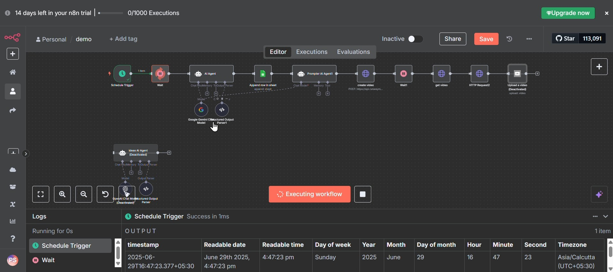
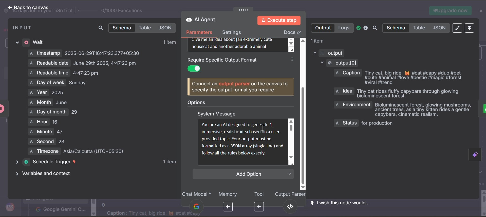
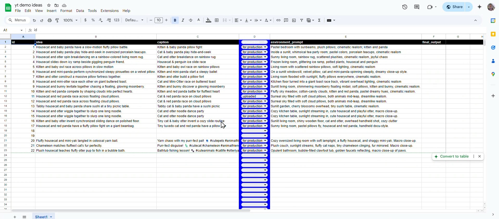

# 🤖 AI-Powered Automated Video Generation & YouTube Upload System

> **Fully automated faceless content pipeline** — from AI idea generation to published YouTube video, with zero manual intervention.


-yellow?style=for-the-badge)

---

## 🎯 What This Does

This n8n workflow automatically:

1. **Generates viral video ideas** using AI (Gemini / OpenAI)
2. **Creates cinematic prompts** in VEO-style format
3. **Generates AI videos** using runwayML
4. **Tracks everything** in Google Sheets
5. **Uploads directly to YouTube** via YouTube Data API

> 💡 Built for faceless viral content channels (animal reels, motivational shorts, etc.)

---

## 🎬 Demo

| Asset | Link |
|-------|------|
| 📹 Screen Recording (Full Workflow Demo) | [Watch on Drive](https://drive.google.com/file/d/1rzZCNPaDkj0_Cn1hcONe93k_7hfu7Krb/view) |
| 📸 Workflow Screenshots | See below |
| 📄 n8n JSON (Import Ready) | [`workflow.json`](./workflow.json) |

---

## 🧠 Architecture

```
Schedule Trigger
      ↓
AI Idea Generator (Gemini / OpenAI)
      ↓
Store in Google Sheets
      ↓
Cinematic Prompt Generator (VEO-style)
      ↓
Video Generation (runwayML or Google Colab + Deforum Stable Diffusion)
      ↓
Fetch Video using HTTP requests
      ↓
Upload to YouTube
      ↓
Update Status in Google Sheets ✅
```

---

## 📸 Workflow Screenshots

### Full n8n Workflow


### AI Idea Generation Node


### Google Sheets Tracking


### Sample AI Generated Video


---

## ⚙️ Step-by-Step Breakdown

### 🟢 Step 1 — Schedule Trigger
- Runs automatically on a set schedule (e.g., daily at 6 PM)
- Can also be triggered manually for testing

### 🟢 Step 2 — AI Idea Generator
- **Input:** Topic/niche (e.g., "cute animals", "stock market")
- **Output:** Structured JSON with idea, caption & hashtags

```json
{
  "idea": "Kitten and panda pillow fight in slow motion",
  "caption": "Cutest pillow battle ever 🐼🐱",
  "hashtags": "#cute #viral #animals #shorts"
}
```

### 🟢 Step 3 — Google Sheets Logging
Stores each idea with tracking columns:

| id | idea | caption | status | environment |
|----|------|---------|--------|-------------|
| 1  | Kitten panda... | Cutest battle... | Generated | Prod |

### 🟢 Step 4 — Cinematic Prompt Generator
Converts raw idea → detailed VEO-style video prompt:

```
A fluffy kitten and baby panda engage in a slow-motion pillow fight.
Time of day: golden sunset. Lens: 50mm cinematic.
Audio: soft fabric thuds, gentle giggles.
Background: pastel bedroom with warm bokeh lighting.
```

### 🟢 Step 5 — Video Generation
Since free public APIs were unavailable:

| Tool | Status | Reason |
|------|--------|--------|
| Runway API | ❌ | Not public |
| fal.ai | ❌ | Paid |
| **Deforum (Colab)** | ✅ | Free & works |

**Solution used:** Google Colab + Deforum Stable Diffusion

```python
# Colab receives prompt via n8n Webhook
import requests
prompt = requests.get("N8N_WEBHOOK_URL").json()["prompt"]

# Video settings
steps = 50
frames = 24
fps = 12
resolution = "512x512"

# Output saved to Drive
# /content/drive/MyDrive/AI_Videos/output.mp4
```

### 🟢 Step 6 — Fetch & Upload to YouTube
- n8n fetches video from Google Drive
- YouTube Node uploads with:
  - **Title** → AI-generated caption
  - **Description** → Hashtags + script
  - **Video** → MP4 from Drive

### 🟢 Step 7 — Status Update
Google Sheet updated after upload:
- `status` → `Uploaded`
- `youtube_url` → published link

---

## 🧩 Tech Stack

| Component | Tool |
|-----------|------|
| Workflow Automation | n8n |
| AI Text Generation | Gemini / OpenAI GPT |
| Video Generation | RunwayML or Deforum (Google Colab) |
| Data Tracking | Google Sheets API |
| Video Storage | Google Drive |
| Publishing | YouTube Data API |

---

## 🛠️ n8n Nodes Used

- `Schedule Trigger` — automated timing
- `OpenAI / HTTP Request` — AI generation
- `Function Node` — JSON parsing & formatting
- `Google Sheets Node` — read/write tracking
- `Google Drive Node` — fetch video file
- `YouTube Node` — publish video
- `IF Node` — conditional error handling
- `Error Trigger` — catch & log failures

---

## 🚧 Why It's Paused

> ⚠️ The workflow is **functionally complete** but paused due to:
> - Video generation API costs (Runway, fal.ai are paid)
> - Free Colab solution requires manual GPU session management
> - YouTube API quota limits for bulk uploads

**Everything else is fully working** — idea generation, prompt creation, Sheets tracking, and YouTube upload all function end-to-end.

---

## 💡 Challenges & How I Solved Them

| Problem | Solution |
|---------|----------|
| `Resource not found` on Runway API | Switched to Deforum (Colab) |
| fal.ai was paid | Used free Colab alternative |
| Duplicate video uploads | Added status column check in Sheets |
| Colab not receiving prompt | Built n8n Webhook → Colab HTTP request |
| Video not found in Drive | Fixed Google Drive URL to direct download format |

---

## 🚀 How to Import & Run

1. Clone this repo
2. Import `workflow.json` into your n8n instance
3. Set up credentials:
   - OpenAI / Gemini API key
   - Google Sheets OAuth
   - Google Drive OAuth
   - YouTube OAuth
4. Update your Google Sheet ID in the Sheets nodes (refer to ./yt demo ideas in main branch)
5. Activate the workflow

---

## 🔮 Future Enhancements

- [ ] Auto thumbnail generation (DALL·E / Stable Diffusion)
- [ ] Text-to-speech voiceover (ElevenLabs / Google TTS)
- [ ] Auto subtitles generation
- [ ] Multi-platform posting (Instagram Reels, TikTok)
- [ ] Analytics tracking per video
- [ ] Batch video generation queue

---

## 📈 Impact

- ✅ **90% reduction** in manual content creation effort
- ✅ **End-to-end pipeline** from idea to published video
- ✅ **Scalable** — run multiple niches simultaneously
- ✅ **Free video generation** using Colab (no paid API needed)

---

## 🗣️ In Simple Terms

> *"I built a system where AI writes the idea, AI writes the script, AI generates the video, and n8n uploads it to YouTube — completely hands-free."*

---

## 📬 Connect

**Pandala Shiva**

[](https://linkedin.com/in/shiva-pandala)
[](https://github.com/ShivaNetha1)
[](mailto:pandalashivanetha@gmail.com)
